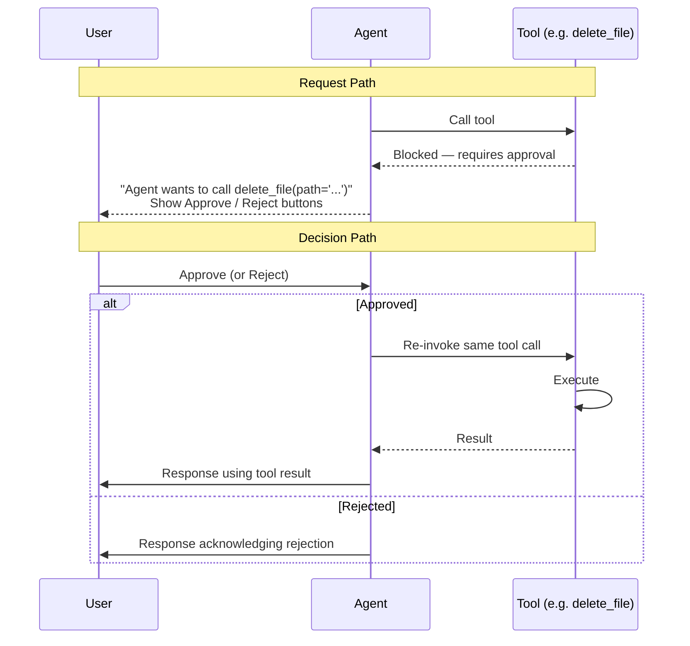
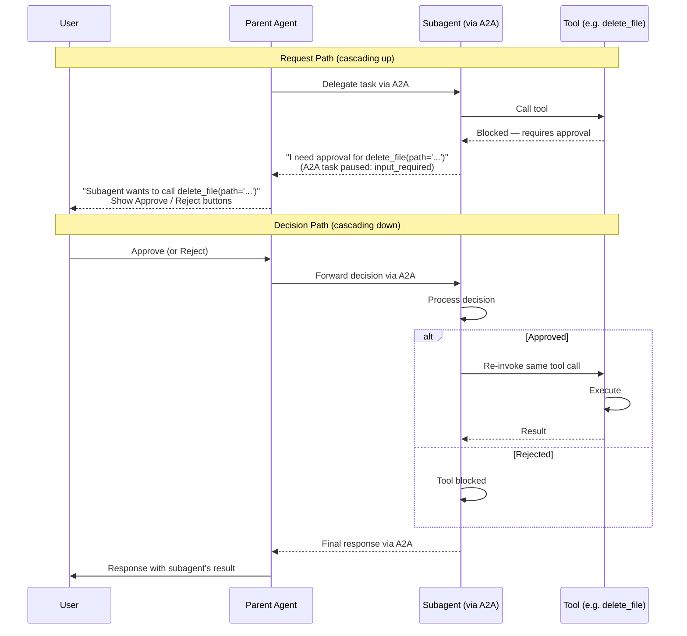
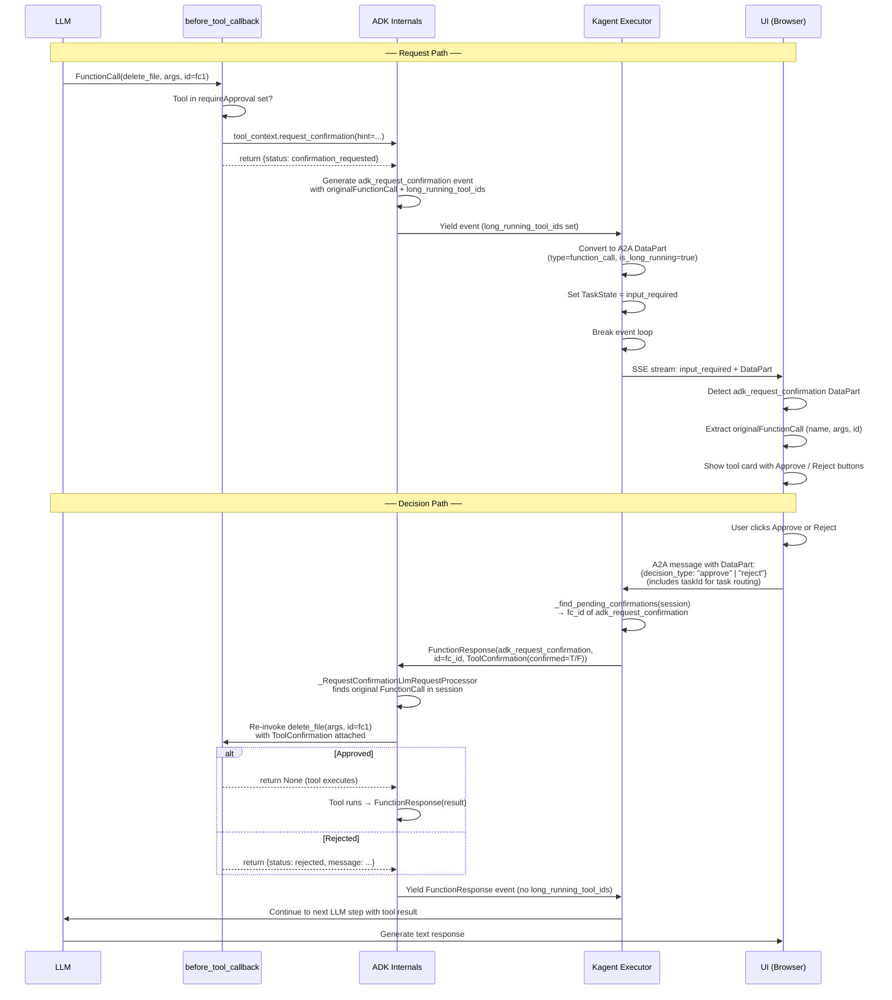
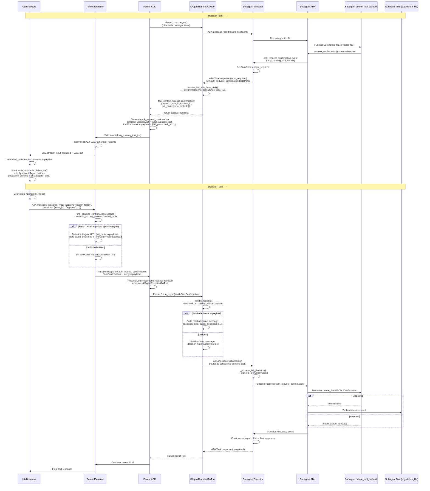

# Human-in-the-Loop

Kagent implements Human-in-the-Loop (HITL) tool approval by combining a custom extension on top of A2A Task-driven communication and Google ADK's built-in `ToolContext.request_confirmation()` mechanism. When an agent or a subagent calls a tool marked with `requireApproval` the system pauses execution and asks the user to approve or reject the call before proceeding. This design avoids as much homebrewed Kagent constants and HITL logic as possible.

Below documents, in depth, how the HITL logic works in Kagent, and how relevant features are designed.

---

## HITL Flows

Kagent supports basic HITL flow, and HITL flow involving subagents, built on the basic type.

Below we show sequence diagrams for 1. high level overview 2. detailed, function-level sequence for both use cases.

The HITL flow is split into two paths: **request path** and **decision path**. The protocol for each path is further explained in [the following section](#hitl-protocol-reference).

### Overview: Direct HITL

When an agent tries to call a tool that requires approval, execution
pauses and the user is asked to approve or reject. No LLM call is
needed on the resume path — the exact same tool call is replayed.



### Overview: Nested HITL

When a parent agent delegates to a subagent via A2A and the subagent
has HITL tools, the approval request cascades up to the user. The
user's decision cascades back down through the same chain.



---

### Detailed Sequence Diagrams

You should only review the following diagrams if you are developing HITL features in Kagent. 
They are extremely specific and you can almost find exact function representing each step in kagent / ADK code.

#### Direct HITL Flow

The direct flow applies when an agent's own tools have `requireApproval`.
It has two paths: the **request path** (tool → user) and the
**decision path** (user → tool).



#### Nested HITL Flow (Parent + A2A Subagent)

When a parent agent delegates to a subagent via A2A and the subagent
has HITL tools, `KAgentRemoteA2ATool` bridges the two agents' HITL
flows using its own two-phase pause/resume cycle.



#### Key Differences Between Direct and Subagent HITL

| Aspect                               | Direct HITL                          | Subagent HITL                                                                                 |
| ------------------------------------ | ------------------------------------ | --------------------------------------------------------------------------------------------- |
| **Who calls request_confirmation()** | `before_tool_callback`               | `KAgentRemoteA2ATool.run_async()`                                                             |
| **What's in originalFunctionCall**   | The actual tool (e.g. `delete_file`) | The outer subagent tool (e.g. `kagent__NS__k8s_agent`)                                        |
| **Inner tool info**                  | Not applicable                       | Stored in `toolConfirmation.payload.hitl_parts`                                               |
| **UI card shows**                    | The actual tool name and args        | Inner tool names/args extracted from `hitl_parts`                                             |
| **Decision routing**                 | Executor → ADK → tool directly       | Executor → ADK → KAgentRemoteA2ATool → A2A → subagent executor → ADK → tool                   |
| **Batch decision IDs**               | Match outer `original_id` directly   | Inner tool IDs; executor detects subagent via `hitl_parts` and forwards batch through payload |

---

## HITL Protocol Reference

This section documents the custom wire formats that Kagent uses on top of the
A2A protocol for HITL. These are the formats you need to know if you are
building a custom UI, an integration client, or debugging HITL flows.

### Server → Client: Request Path

When a tool requires approval, the server sends a `TaskStatusUpdateEvent`
with `state: "input-required"`. The status message contains a `DataPart`
with this structure:

```json
{
  "kind": "data",
  "data": {
    "name": "adk_request_confirmation",
    "id": "<confirmation_id>",
    "args": {
      "originalFunctionCall": {
        "name": "delete_file",
        "args": { "path": "/tmp/x" },
        "id": "<tool_call_id>"
      },
      "toolConfirmation": {
        "hint": "Human-readable description of what needs approval",
        "confirmed": false,
        "payload": null
      }
    }
  },
  "metadata": {
    "kagent_type": "function_call",
    "kagent_is_long_running": true
  }
}
```

**How to detect it:** A DataPart is an approval request when all three
conditions are true:

- `metadata.kagent_type` (or `adk_type`) is `"function_call"`
- `metadata.kagent_is_long_running` (or `adk_is_long_running`) is `true`
- `data.name` is `"adk_request_confirmation"`

**What to display:** The tool name, arguments, and ID come from
`data.args.originalFunctionCall`.

#### Subagent variant

For subagent HITL, `toolConfirmation.payload` is populated with the
subagent's inner tool details:

```json
"payload": {
  "task_id": "<subagent_a2a_task_id>",
  "context_id": "<subagent_context_id>",
  "subagent_name": "k8s_agent",
  "hitl_parts": [
    {
      "name": "adk_request_confirmation",
      "id": "<inner_confirmation_id>",
      "originalFunctionCall": {
        "name": "delete_file",
        "args": { "path": "/tmp/x" },
        "id": "<inner_tool_call_id>"
      }
    }
  ]
}
```

When `hitl_parts` is present, display the **inner** tool names and
arguments (not the outer subagent tool name). The inner tool call IDs
are what you use as keys in batch decisions. Each entry in `hitl_parts`
describes one of the subagent's pending tool calls:

```json
{
  "name": "adk_request_confirmation",
  "id": "<confirmation_fc_id>",
  "originalFunctionCall": {
    "name": "<inner_tool_name>",
    "args": { ... },
    "id": "<inner_tool_call_id>"
  }
}
```

### Client → Server: Decision Path

The client sends a standard A2A `Message` with `role: "user"`. The
message **must** include `taskId` matching the pending approval's task
so the server routes it to the correct paused task.

The message contains two parts:

1. A `DataPart` with the structured decision
2. A `TextPart` with a human-readable label (for display/logging)

#### Uniform approve

```json
{ "kind": "data", "data": { "decision_type": "approve" }, "metadata": {} }
```

#### Uniform reject

```json
{ "kind": "data", "data": { "decision_type": "reject" }, "metadata": {} }
```

#### Batch (mixed or reject-with-reason)

```json
{
  "kind": "data",
  "data": {
    "decision_type": "batch",
    "decisions": {
      "<tool_call_id_1>": "approve",
      "<tool_call_id_2>": "reject"
    },
    "rejection_reasons": {
      "<tool_call_id_2>": "Too dangerous"
    }
  },
  "metadata": {}
}
```

`rejection_reasons` is optional — only include it when at least one
denied tool has a reason.

The `<tool_call_id>` keys are `originalFunctionCall.id` values from the
approval request. For subagent HITL, use the **inner** tool call IDs
from `hitl_parts[].originalFunctionCall.id`.

#### Ask-user answers

When the approval request is for the `ask_user` tool (detected via
`originalFunctionCall.name === "ask_user"`), send answers instead of
a simple approve/reject:

```json
{
  "kind": "data",
  "data": {
    "decision_type": "approve",
    "ask_user_answers": [
      { "answer": ["PostgreSQL"] },
      { "answer": ["Auth", "Caching"] },
      { "answer": ["Add rate limiting"] }
    ]
  },
  "metadata": {}
}
```

The answers array is positional — it corresponds 1:1 with the
`questions` array in the original `ask_user` function call arguments.

---

## Additional Features Docs

### Rejection Reasons

Add an optional free-text reason to rejections. The reason travels through
the existing HITL plumbing using `ToolConfirmation.payload` from the `DataPart` from frontend.

Currently we use two custom keys to indicate rejection reason in the frontend payload and the ADK payload.
This handles parallel tool call rejection as well using the batch flow described above.

In the before-tool callback (`_approval.py`) we will check if payload exists.
If so, we will append the rejection reason to the callback response to tell the model.

---

## Ask-User Tool

Discussed in issue #1415.
Why this is a good idea: https://www.atcyrus.com/stories/claude-code-ask-user-question-tool-guide

A built-in `ask_user` tool that:

- Lets the model pose **one or more questions** in a single call (batched).
- Each question can include **predefined choices** and a flag for whether
  multiple selections are allowed.
- The user always has the option to **type a free-text answer** alongside
  (or instead of) the predefined choices.
- Uses the **same `request_confirmation` HITL plumbing** as tool approval —
  no new executor logic, event converter changes, or A2A protocol extensions.

The tool is added **unconditionally** to every agent as a built-in tool,
similar to how memory tools are added.

#### Tool Schema

```python
ask_user(questions=[
    {
        "question": "Which database should I use?",
        "choices": ["PostgreSQL", "MySQL", "SQLite"],
        "multiple": False                         # single-select (default)
    },
    {
        "question": "Which features do you want?",
        "choices": ["Auth", "Logging", "Caching"],
        "multiple": True                          # multi-select
    },
    {
        "question": "Any additional requirements?",
        "choices": [],                            # free-text only
        "multiple": False
    }
])
```

#### Tool Result (returned to model)

```python
[
    {"question": "Which database should I use?", "answer": ["PostgreSQL"]},
    {"question": "Which features do you want?", "answer": ["Auth", "Caching"]},
    {"question": "Any additional requirements?", "answer": ["Add rate limiting"]}
]
```

---

## Subagent HITL (Remote A2A Agents)

When a parent agent delegates work to a subagent via A2A and the
subagent has tools with `requireApproval`, the subagent's HITL request
must be propagated up to the parent's UI so the user can approve or
reject it.

ADK Agent tool does not handle input required states and remote a2a agent cannot forward HITL messages.

Therefore, Kagent replaces the `AgentTool(RemoteA2aAgent(...))` pairing with
`KAgentRemoteA2ATool` — a single `BaseTool` that directly manages the
A2A client conversation and uses `request_confirmation()` to propagate
HITL state through the parent agent's native confirmation flow.

#### Payload Preservation

The `payload` passed to `request_confirmation()` contains state the
tool needs on resume (the subagent's `task_id`, `context_id`, and the
inner HITL details). This payload is serialized into the
`adk_request_confirmation` FunctionCall's `args.toolConfirmation.payload`
and stored in the session event history.

On resume, `_find_pending_confirmations()` extracts the original payload
from the session event, and `_build_confirmation_payload()` merges it
with any decision-specific keys (e.g. `rejection_reason`). This ensures
the tool's `_handle_resume` can read `task_id` and `context_id` from
`tool_context.tool_confirmation.payload` to route the decision to the
correct subagent task.

#### Nested Subagents

The mechanism works recursively. If subagent A calls subagent B via
A2A and B has HITL tools, B returns `input_required` to A, A's
`KAgentRemoteA2ATool` calls `request_confirmation()`, which propagates
up to A's parent, and so on. Each level independently manages its own
two-phase pause/resume cycle.

However, you are strongly discouraged to nest subagents for various reasons right now.
